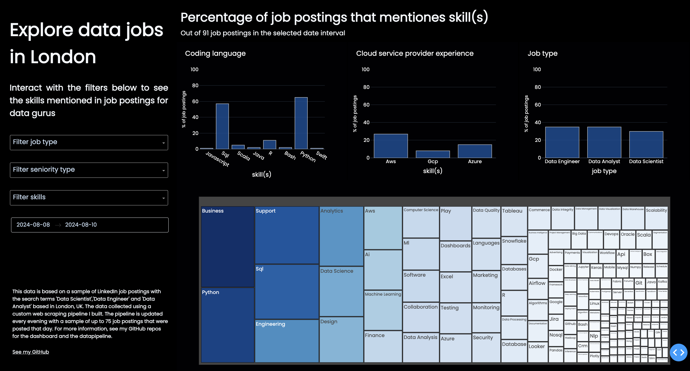

# Dashboard of skills mentioned in data-related roles
This repository hosts a dynamic dashboard built using Dash, integrated with Flask, to provide real-time insights into the skills demanded in data job postings within London, UK. The dashboard is designed for data professionals to analyze and understand the specific skills required for various data-related roles. It leverages Polars for efficient data manipulation, enabling rapid processing. The data is updated daily using the pipeline I build [here:](https://github.com/lalelisealstad/dataengineer-job-scraper-etl). Key features include interactive visualizations that break down the prevalence of different skills across job titles, allowing users to understand which skills are desired in the job market. 

(soon to be available at): 

Screenshot of page: 


#### Development Notes:
To run the program for the first time:
```
$ python3 -m venv .venv
$ source .venv/bin/activate 
$ pip install -r requirements.txt
```

Run the program after installation:
```
$ source .venv/bin/activate
$ python "main.py"
```


### Develop to-do: 
- deploy to gcp cloud run 
- readme description of deployment

### Develop improvements: 
- split filters into seperate callbacks and store data in dcc for faster callbacks filters
- clientside callbacks for faster callbacks
- more locations and filter selection 